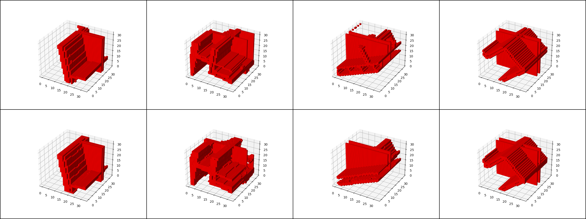
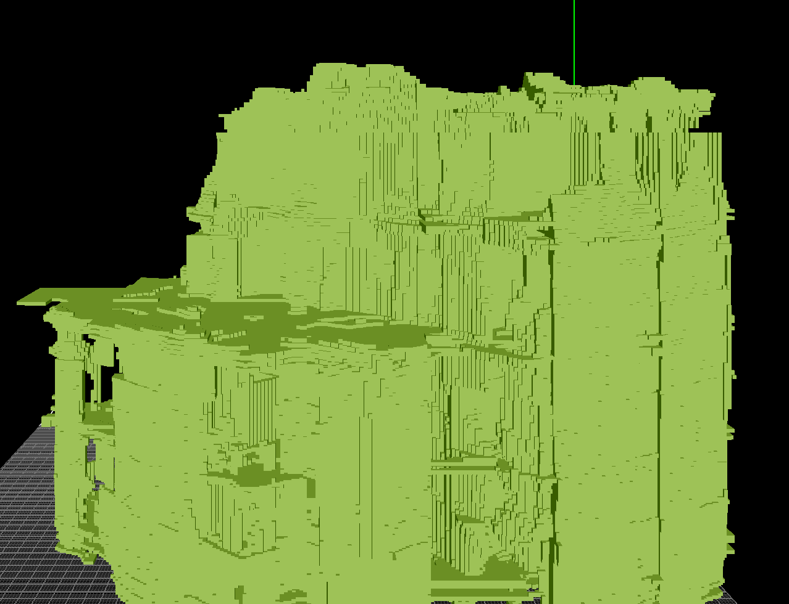
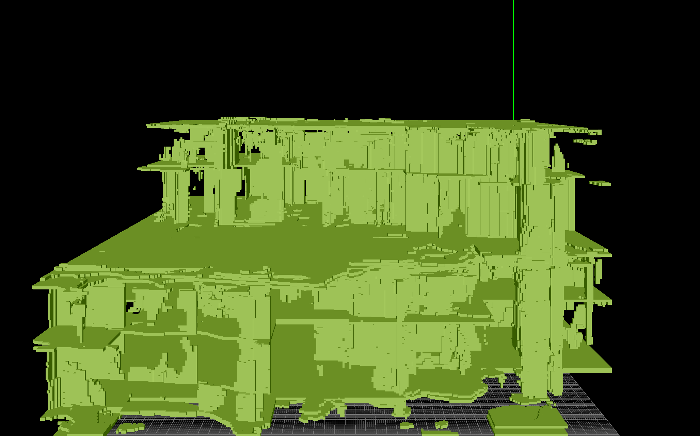
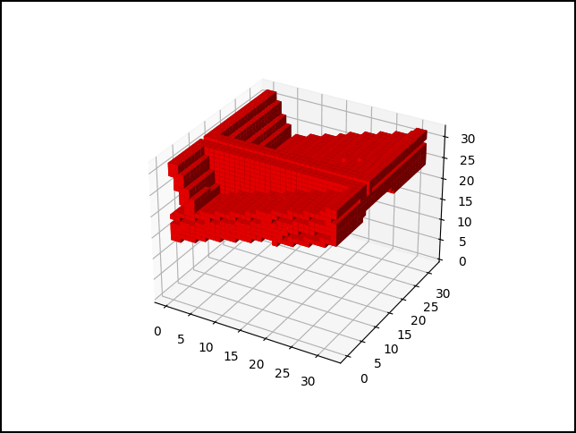

# ArchVoxel Repo

The model should create voxel representations of buildings using latent diffusion and an intermediate VAE.

The training procedure is as follows:

* Use `Vae.py` to train the VAE to compress 32³ voxel chunks into a N-dimensional vector. The buildings in /data have a varying size and are split into these chunks. Top row shows reference, bottom row is the reconstruction. 
* `Latent_preprocess.py` takes the whole building and calculates a tensor of VAE-compressed representations. This could be done during the diffusion model training, but it's quite slow and can be preprocessed.
* `traindiffusion.py` is then used to train the diffusion model based on the latent representation. Intermediate results are saved in the binvox format. 
* `interpolate.py` can be used to visualize the latent space interpolation. 

## TODOs
* [ ] Enlarge train data set.
* [ ] The diffusion model has only been trained for 100k steps with a small model. Still figuring out the best model complexity and training scheduling!
* [ ] Eventually increase voxel resolution and add more data into the voxel (not just binary visibility) to reconstruct geometry